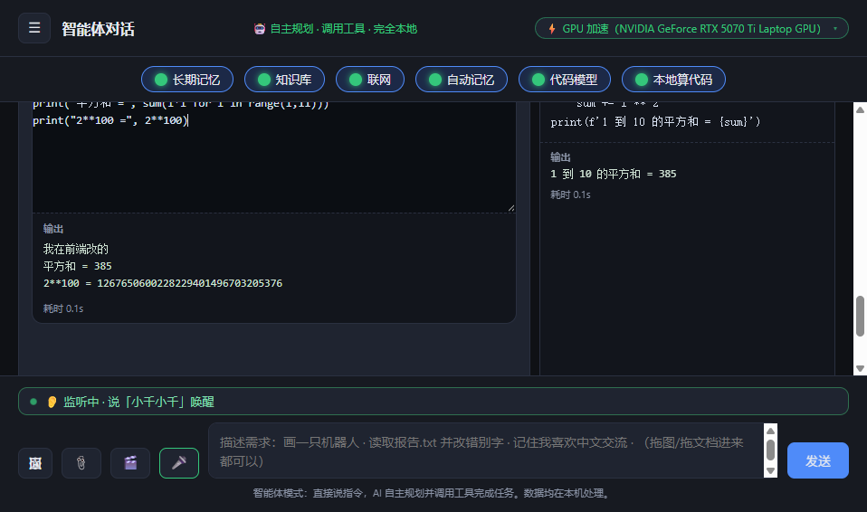
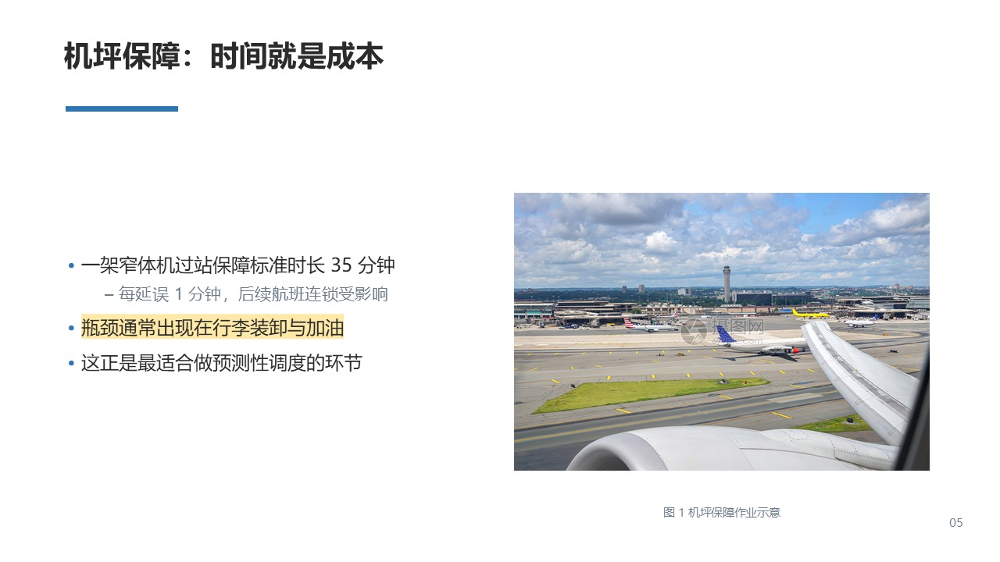
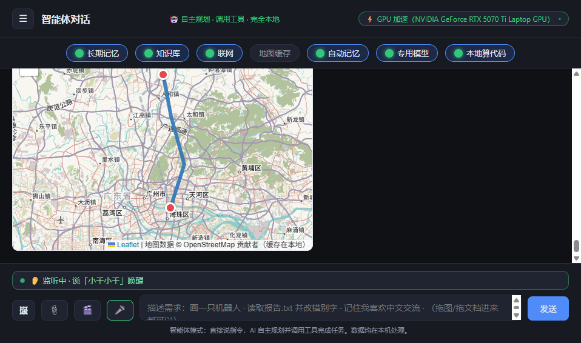
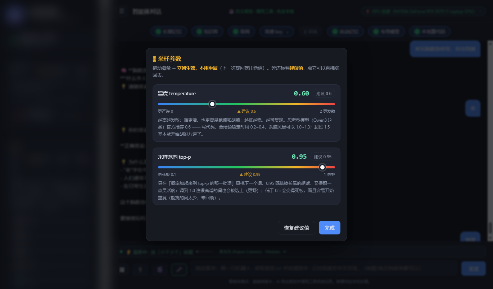
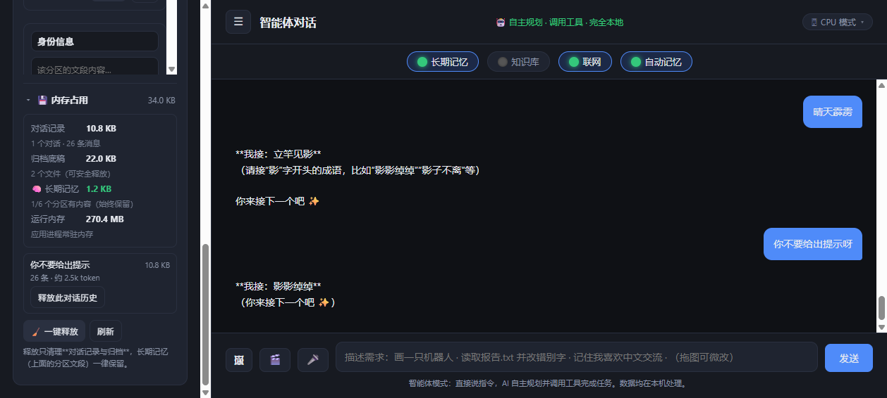

# 本地多模态助手

**可私有化部署的本地 AI Agent —— 数据不出内网，边际成本趋近于零**

39 个工具编排 · 分层记忆 · 双协议工具调用 · 3.5 万行 · 断网可用




---

## 这是什么

一个**完全跑在自己机器上、全程不联网**的 AI 助手。

它不是"套壳调用某个云 API"——模型权重在本地，语音识别在本地，图片生成在本地，**断网之后功能一个不少**。

但它真正的看点不止是"离线"，而是它是**一套完整的 Agent 系统**：39 个工具、双协议工具调用、分层记忆、知识库检索、工作区管理、并行执行调度。这些东西拼在一起，代码量到了 3.5 万行。

如果你只有 30 秒：直接看 [技术难点](#技术难点) 那一节。

---

## 为什么做这个

起点很朴素：**高频调用云端 API，token 成本不可控。**

于是转向本地化方案，把「按量付费」换成「一次性投入 + 边际成本 ≈ 0」。做完之后发现它还有一个意料之外的价值——因为完全离线，可以直接部署进内网，**数据不出机器**。

这对相当一部分场景不是"省钱选项"，而是"唯一可行选项"：

| 场景 | 为什么必须是本地 |
|---|---|
| 政企内网 | 数据不得出网，是硬性规定 |
| 涉密单位 | 根本不允许调用外部 API |
| 医疗 / 金融 | 合规与隐私要求 |
| 中小企业 | 既不想付持续 API 费用，也不想数据外流 |

**成本结构对比**

|  | 云端 API | 本项目（本地） |
|---|---|---|
| 单次调用成本 | 按 token 计费 | **0 元** |
| 前置投入 | 0 | 显卡（一次性） |
| 持续成本 | 随用量线性增长 | 仅电费 |
| 数据流向 | 出机器 | **不出机器** |
| 可用性 | 依赖网络与第三方服务 | **断网可用** |
| 能力上限 | 顶级大模型 | 本地 8B 级模型 |

**定位一句话**：不是"更便宜的云 API"，而是"把 AI 搬进内网"。

---

## 界面速览

**对话与工具卡片** —— 39 个工具按需自主调用，代码执行结果直接内联展示：


**本地绘图** —— Stable Diffusion Turbo 出图 + Real-ESRGAN 4 倍超分，全程离线（下图 2048×2048 为超分结果）：


**Office 文档生成** —— 直接产出可用的 pptx / docx / xlsx，自动配图、图注、页脚来源：



**地图与路线** —— 离线 OSM / 在线高德双模式，POI、路线、天气卡片：



**采样参数在线调节** —— 温度 / top-p 两条滑条，旁边标着建议值，拖完立刻生效：



**记忆与上下文占用** —— 长期记忆 1/6 分区、短期记忆按会话隔离，可一键释放：



---

## 技术难点

这部分是这个项目的核心。下面每一节都是**真实踩过的坑**，不是教科书上的概念。

### 一、并行执行里的"副作用顺序"陷阱

**问题**：用户反馈"AI 建完项目，里面却是空的"。

**根因**：模型在同一轮里同时发起两个工具调用：

```
workspace_new_project   →  建项目，并把「当前项目」切过去
workspace_write         →  往「当前项目」写文件
```

工具是 `asyncio.gather` 同时开跑的。写文件可能在切项目之前就读到了旧的 `active_project`，文件于是落进了**上一个项目**。

**关键认知**：`asyncio.gather` 只保证「结果按原顺序合并」，**副作用早就以任意顺序发生了**。这是并发编程里最容易看走眼的地方——顺序看起来是对的，状态却是错的。

**解法**：对工具做依赖分级。

```python
_SERIAL_TOOLS = {
    "workspace_new_project", "workspace_use_project",
    "workspace_write", "workspace_mkdir", "workspace_delete",
    "workspace_move", "workspace_run", "run_python",
    "save_file", "library", "github_push",
}
_serial = any(n in _SERIAL_TOOLS for n, _a in calls)
```

- 本轮出现会改共享状态或依赖当前项目的工具 → **整轮串行**，顺序＝模型给出的顺序
- 纯读类（查知识库 / 联网 / 看时间）→ 仍然**并行**，不牺牲速度

并且每个工具用独立的 `ui_events` 列表，避免并发写入互相污染，最后按原序号合并，保证前端看到的次序稳定。

### 二、流式输出被"憋成一次性返回"

**问题**：明明开了 `stream=True`，前端却要等全部生成完才看到字。

**根因**：`requests.iter_lines()` 是**阻塞**的。直接在 asyncio 事件循环里读它，整个循环会被卡死，SSE 数据全堆在缓冲区里出不去。

**解法**：子线程阻塞读 + 队列传递。

```python
q: asyncio.Queue = asyncio.Queue(maxsize=256)

def _worker():
    for line in resp.iter_lines():
        asyncio.run_coroutine_threadsafe(q.put(line), loop)

threading.Thread(target=_worker, daemon=True, name="ollama-stream").start()
# 主循环： await q.get() —— 事件循环始终空闲，每来一块立刻推给前端
```

配合 `maxsize=256` 做**背压**：前端不消费时队列会满，停止读取，模型也就不会空转白烧显卡。

### 三、模型卸载重载导致"回答凭空消失"

**问题**：用户看到"模型加载一半、思考一半、没有回答"。

**根因**：Ollama 只要发现 `num_ctx` 与当前已加载模型不一致，就会**卸载并重载模型**（实测约 5 秒），而重载会中断正在进行的生成。后台的记忆提炼任务用 4096，聊天用 8192，于是：

```
聊天 → 记忆提取(触发重载) → 用户再发消息(又重载) → 生成被打断
```

**解法**：在最底层统一收口，而不是要求每个调用点自觉对齐。

```python
# num_ctx 一律取全局配置，忽略调用方传入的值。
# 与其要求每个调用点自觉对齐，不如在这里统一收口 ——
# 多一个调用点也不会再踩这个坑。
fixed_ctx = int(config.load_config().get("num_ctx") or 8192)
payload["options"]["num_ctx"] = fixed_ctx
```

这是一个设计决策：**把约束的强制点放在最靠近外部依赖的那一层。**

### 四、思考打转：重复段的检测与重试

**问题**：Qwen3-VL 偶尔在思考过程里原地打转（同一个例子反复推敲），把 `num_predict` 配额烧光，正文一个字都没写出来。

**分析**：`repeat_last_n` 是 Ollama 的防重复参数，**默认只有 64 个 token（约 40 个汉字）**——而打转是**段落级**的，重复段本身就 30~60 字，64 的窗口根本盖不住。

**解法**（三管齐下）：

1. **参数调整**：`repeat_penalty` 抬到 1.2，`repeat_last_n` 放大到 1024
2. **运行时检测**：`find_looping_piece(text, threshold=3)` 实时识别重复段
3. **加长重试**：检测到打转就作废本轮思考、加长输出上限重试（见 `test_thinking_retry.py`）

> ⚠️ 还有个坑：采样参数传 `None` 会**覆盖掉 Ollama 自己的默认值**（反而更糟），所以必须逐个判空后再传。

### 五、上下文预算的精确记账

`num_ctx` 这笔账要精打细算：

```
num_ctx = 系统提示 + 工具定义 + 历史 + 本轮输出 + 检索材料
           ↑写死      ↑写死     ↑可压缩   ↑预留      ↑动态
```

系统提示和 39 个工具的 schema 是固定开销，唯一能压缩的只有历史。而且：

```python
# 联网时，工具结果（8 条检索 + 若干篇网页正文）会在工具循环里追加进上下文，
# 此时还不知道具体多大 —— 按实测约 3600 token 预留，
# 否则「历史 + 检索材料」一起会撑爆窗口，Ollama 直接截断提示词。
search_reserve = 3800 if cfg.get("web_enabled") else 0
budget = ctx_limit - reserve_out - overhead - search_reserve - 512
```

丢掉的历史不直接扔——会压成「较早对话摘要」注入，否则用户回头问"开头聊了什么"，模型会一脸茫然（实测踩过）。

### 六、工具调用的双协议兜底

原生 Function Calling 是首选，但小模型在长上下文里经常不按 schema 出牌——该返回 `tool_calls` 的时候吐了一段文本。

所以做了双通道：

| 通道 | 触发 | 说明 |
|---|---|---|
| 原生协议 | 模型正常返回 `tool_calls` | 标准方式，`tool` 消息用 `tool_name` 关联 |
| 文本协议 | 模型把调用"写"成文本 | `_split_text_tool_calls()` + `_loads_lenient()` 容错解析 |

`_loads_lenient` 能容忍：尾部逗号、单引号、Markdown 代码块包裹、前后夹杂解释文字。

这个设计的意义：不是"兼容一下"，而是**让 Agent 在模型能力不足时不至于整体失效**。

---

## 架构

```
┌──────────────────────────────────────────────────────────┐
│  前端（原生 HTML / CSS / JS，8800 行）                     │
│  流式渲染 · 工具卡片 · 地图 · 文件树 · 语音状态             │
└────────────────────────┬─────────────────────────────────┘
                         │ SSE 流
┌────────────────────────▼─────────────────────────────────┐
│  FastAPI 后端                                             │
│  ┌───────────────────────────────────────────────────┐   │
│  │  对话主循环   main.py（5000 行）                    │   │
│  │  · 历史裁剪与摘要    · 工具循环（并行 / 串行调度）    │   │
│  │  · 流式转发          · 双协议解析                    │   │
│  └───────────────────────────────────────────────────┘   │
│                                                          │
│  工具层（39 个，tools.py 4000 行）                         │
│  ├─ 工作区    项目 / 文件 / 目录 / 代码执行                 │
│  ├─ 文档      pptx · docx · xlsx · Office 编辑            │
│  ├─ 知识库    索引 · 检索 · 多格式取文                      │
│  ├─ 地图      离线 / 在线双模式 · POI · 路线                │
│  ├─ 联网      多引擎并行搜索 · 网页正文                     │
│  ├─ 图像      文生图 · 图片微改 · 联网图搜                  │
│  └─ 记忆      长期 / 短期分层读写                           │
│                                                          │
│  基础能力                                                 │
│  ├─ Ollama 客户端（子线程阻塞读 + 队列）                    │
│  ├─ 记忆库     长期（15000 字）+ 短期（按会话隔离）          │
│  ├─ 语音       离线唤醒 sherpa-onnx                        │
│  └─ 工作区     沙箱化文件系统                              │
└────────────────────────┬─────────────────────────────────┘
                         │ 仅 127.0.0.1:11434
┌────────────────────────▼─────────────────────────────────┐
│  Ollama  ──→  Qwen3-VL-8B（本地权重，约 6GB，显存占用 ~11.5GB）│
└──────────────────────────────────────────────────────────┘
```

---

## 功能清单

<details>
<summary><b>点开看完整功能</b></summary>

**对话**
- 流式输出、思考过程可见、随时「终止」不占显卡
- 模型可自主规划并调用工具，工具执行过程以卡片形式内联展示
- **随时「终止」**：发送键旁边的停止按钮，点了模型真的会停下

**看图 / 多模态**
- Qwen3-VL 原生多模态，拖拽图片直接问
- 图片微改（img2img）：描述"把背景换成夜晚"即可

**本地绘图**
- 文生图（SD-Turbo，4 步出图）
- 图片微改（img2img）
- 4 倍超分（Real-ESRGAN，512 → 2048）
- 界面可切换「自动 / GPU / CPU」，右上角徽章实时显示当前设备

**Office 文档**
- 生成 `.pptx` / `.docx` / `.xlsx`，反潮流地做得比较完整：
  封面、目录、角标、页脚来源、荧光笔标注、表格、图表、时间线、卡片、图文并排
- 也能**改现有文档**（`edit_office`）
- 生成完可直接在「文档库」里打开文件夹

**知识库**
- 支持 `.pdf` / `.docx` / `.xlsx` / `.pptx` / `.txt` / `.md` 自动识别入库
- 相关性检索，命中片段注入上下文

**地图与天气**
- 离线 OSM / 在线高德**双模式**，一键切换
- 地点搜索（高德含真实评分）、周边 POI、路线规划
- 天气数据走中国气象局

**联网**
- 多引擎并行搜索、网页正文抓取、图片搜索
- 一张「联网」开关总控；离线时不发任何请求

**记忆**
- **长期记忆**（全局，15000 字上限）＋ **短期记忆**（按会话隔离）
- 自动提炼，防抖 6 秒；可一键释放某段对话历史

**工作区**
- 沙箱化项目 / 文件管理，文件树、增删改
- 在工作区里跑 Python（支持 `input()` 交互）
- 打包 zip、GitHub 推送

**代码执行**
- 沙箱里跑 Python，实时输出
- 超时语义经过专门设计：**"跑不完"不等于"代码有错"**，长驻程序只做冒烟检测并如实说明

**语音**
- 离线唤醒词「小千小千」（sherpa-onnx，不联网）
- 流式识别，停顿自动发送
- 麦克风下拉 + 实时电平条，采不到声音看得见

**其它**
- 图片库 / 文档库，可预览、重命名、导出
- 采样参数在线调节（温度 / top-p，拖完立刻生效）
- Docker 一键部署（在线拉镜像 / 离线包两种模式）

</details>

---

## 快速开始

### 方式一：Windows 一键包（推荐）

下载 **[`releases/本地多模态助手-轻量版-Windows-x64.zip`](releases/本地多模态助手-轻量版-Windows-x64.zip)**（约 100MB）→ 解压 → 双击运行。

语音功能需额外下载 **[`releases/asr-model-zh-14M-int8.zip`](releases/asr-model-zh-14M-int8.zip)**（约 20MB），解压到 `_internal/asr_model/`。

### 方式二：源码运行

```bash
# 1. 安装 Ollama
#    https://ollama.com   （或 winget install Ollama.Ollama ）

# 2. 拉取模型（约 6GB，只需一次）
ollama pull qwen3-vl:8b

# 3. 安装依赖
pip install -r requirements.txt

# 4. 启动
python run.py
```

浏览器自动打开 <http://127.0.0.1:8000>。

### 方式三：Docker（离线部署）

双击 **`一键部署.bat`**

脚本会自动：检查引擎 → 探测宿主机 Ollama（有则直连、零下载）→ 导入离线镜像 → 启动 → 健康检查 → 打开浏览器。

RTX 50 系显卡需用 cu130 重建：`--build-arg TORCH_INDEX=https://download.pytorch.org/whl/cu130`

> 也可以从镜像仓库部署（不用拷 27GB 交付包），见 [`docker/从镜像仓库部署.md`](docker/从镜像仓库部署.md)。

---

## 环境要求

| 项目 | 要求 |
|---|---|
| 操作系统 | Windows 10 / 11（Linux / macOS 可手动运行） |
| 显卡 | NVIDIA，显存 ≥ 8GB（**推荐 12GB**） |
| 内存 | ≥ 16GB |
| 硬盘 | ≥ 20GB（模型 6~15GB） |

**性能参考**（RTX 5070 Ti Laptop **12GB**，实测）：首次加载 10~30 秒，生成速度 20~40 token/s，显存占用约 11.5GB（`num_ctx=24576`）。

> 显存不足时把 `config.json` 里的 `num_ctx` 调低（如 8192 或 4096）。

---

## 测试

**13 个测试脚本，约 3300 行**，每个都对应一个真实修过的 bug：

| 脚本 | 验证什么 |
|---|---|
| `test_smoke.py` | 工具注册完整性（schema / append / dispatch / 实现函数四处对齐）+ 全工具实跑，在临时数据目录中运行，不污染用户库 |
| `test_loop.py` | 思考打转检测与修复；采样参数是否真的进了请求体 |
| `test_thinking_retry.py` | 重试时必须作废上一轮思考 |
| `test_text_tool_leak.py` | 工具调用泄漏成代码卡片（```tool 围栏 / `<function-call>` 包装 / 裸 JSON / 半截标签）、`input()` 无法输入 |
| `test_tool_leak_e2e.py` | 起一个**存根 Ollama** 强制吐出三种泄漏写法，验证"用户一个字都看不到 + 工具真的被执行了" |
| `test_tool_leak_frontend.mjs` | 前端最后一道闸 `stripToolLeak`（把 app.js 里的函数**原样抠出来**跑用例） |
| `test_run_timeout.py` | 执行超时被强杀后，**不能让模型误以为自己的代码写错了** |
| `test_memory_extract.py` | 长期记忆提炼的取舍口径：该记的记、不该记的不记 |
| `test_voice.py` | 唤醒不灵敏、识别重复字（"小千小千"→"小小千小千千"） |
| `test_map_offline.py` | 离线模式**一个网络请求都不发**（用 urlopen 钩子实测，不靠肉眼看看代码） |
| `test_mode_switch.py` | 联网 / 离线来回切换 |
| `test_weather.py` | 天气数据源契约 |
| `test_sampling_ui.mjs` | 采样面板浏览器端到端（CDP 驱动无头浏览器**真点**，不靠读代码） |

```bash
python test_smoke.py       # 无需启动应用
python test_loop.py
```

**测试设计原则**：优先验证"没法靠跑一遍应用看出来"的东西。

比如记忆提炼是后台跑的、有防抖、还慢——跑一遍界面根本验证不了，只能写测试。

---

## 项目结构

```
.
├── backend/
│   ├── main.py            对话主循环、路由、流式、工具调度
│   ├── tools.py           39 个工具的定义与分发
│   ├── ollama_client.py   Ollama 客户端（流式）
│   ├── memory.py          长期 / 短期分层记忆
│   ├── kb.py              知识库索引与检索
│   ├── workspace.py       沙箱化工作区
│   ├── doc_extract.py     多格式取文
│   ├── docx_maker.py      ┐
│   ├── xlsx_maker.py      ├ 文档生成
│   ├── pptx_maker.py      ┘
│   ├── map_tools.py       地图（离线 / 在线）
│   ├── web_tools.py       联网搜索
│   ├── t2i.py             本地绘图
│   └── voice.py           离线语音
├── frontend/              原生 HTML / CSS / JS
├── docker/                Docker 构建与部署
├── build/                 PyInstaller 打包
├── scripts/               一键脚本
├── releases/              发布包
└── test_*.py / *.mjs      13 个测试脚本
```

---

## 设计取舍

**1. 为什么完全本地，不做"本地优先 + 云端兜底"？**

因为目标场景（内网部署）下，"兜底"本身就是违规的。只要存在一条通往公网的调用路径，这个方案在政企内网里就不可用。所以宁可牺牲一部分能力上限，也要保证**架构上不存在任何外部依赖**。

**2. 为什么不用 LangChain / LlamaIndex？**

因为需要**精确控制**。工具循环的串行/并行判定、上下文的逐项记账、流式的背压处理——这些在框架里要么做不到，要么得改源码。3.5 万行里有一大半是在处理框架不管的边界情况。

**3. 为什么用文本协议兜底？**

因为本地 8B 模型的能力边界很明确。原生 Function Calling 在长上下文里会失效，如果不兜底，整个 Agent 就废了。加一层容错解析，换来的是"降级可用"而不是"整体崩溃"。

---

## Roadmap

- [ ] 拆分 `main.py`（当前 5000+ 行，计划把对话主循环独立成模块）
- [ ] 引入 pytest + GitHub Actions CI
- [ ] 补一份内网部署文档（环境要求 / 数据落盘位置 / 离线安装流程）
- [ ] 把踩坑记录整理成独立文档

---

## 作者

**陈宇桐**
广州民航职业技术学院 · 人工智能技术应用

主要方向：AI 应用开发 / 多模态与 Agent / 本地化部署

GitHub：[@chenyt-Indom](https://github.com/chenyt-Indom)

---

## License

- 本工具：**Apache 2.0**
- 模型 Qwen3-VL-8B：**Apache 2.0**（免费商用）

---

## 更多文档

| 文档 | 内容 |
|---|---|
| [`docs/使用手册.md`](docs/使用手册.md) | 详细使用说明、参数说明、常见问题 |
| [`docker/使用说明.md`](docker/使用说明.md) | Docker 部署、显卡适配、离线包说明 |
| [`docker/从镜像仓库部署.md`](docker/从镜像仓库部署.md) | 只拿镜像地址时的部署方式 |
